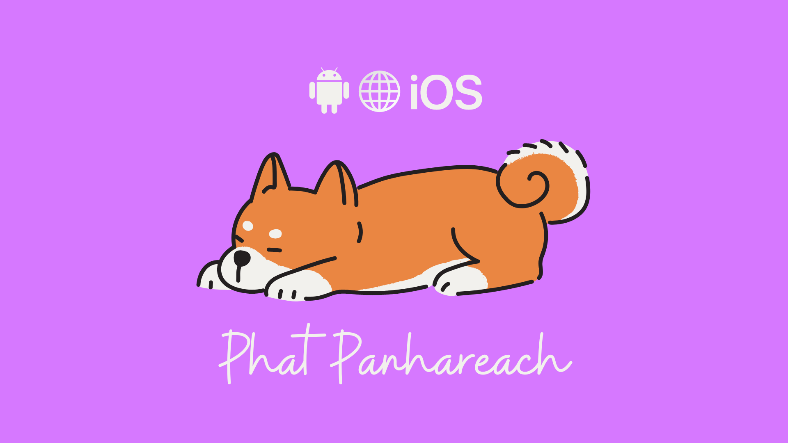

### Hi there 👋 

 

 

Welcome to my Github page! 

- I ❤️ coding
- I ❤️ Laravel, Express for Backend, APIs
- I ❤️ React for bulding UI on the Web
- I ❤️ Flutter for Cross Platform Development
- I ❤️ building <a href="https://github.com/Re4ch-Jay/Open-Source-Flutter-Projects">mobile app</a> when I have free time

<!---
Re4ch-Jay/Re4ch-Jay is a ✨ special ✨ repository because its `README.md` (this file) appears on your GitHub profile.
You can click the Preview link to take a look at your changes.
--->
